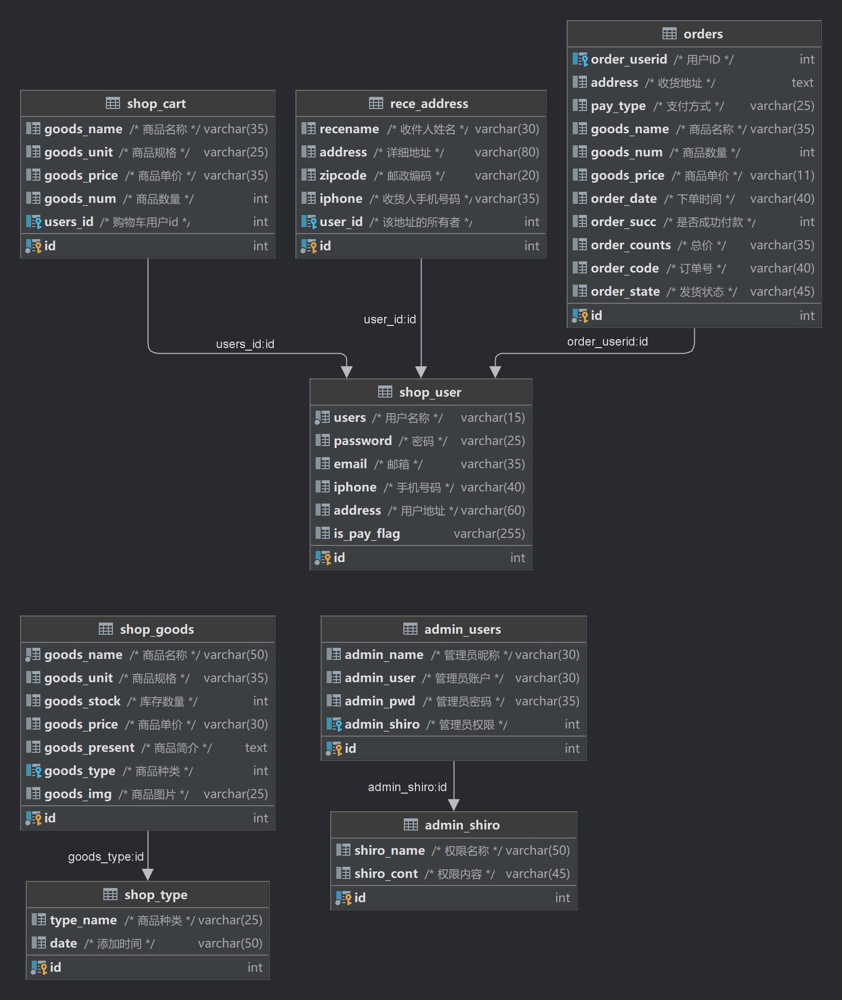
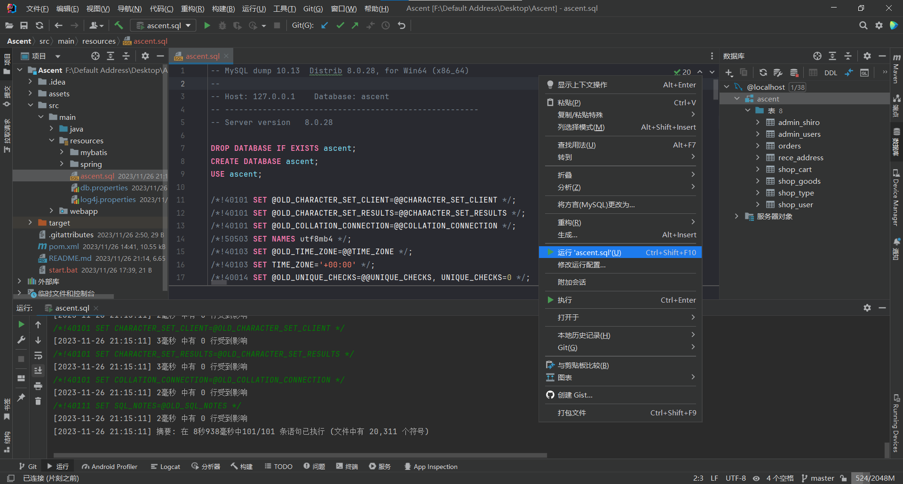
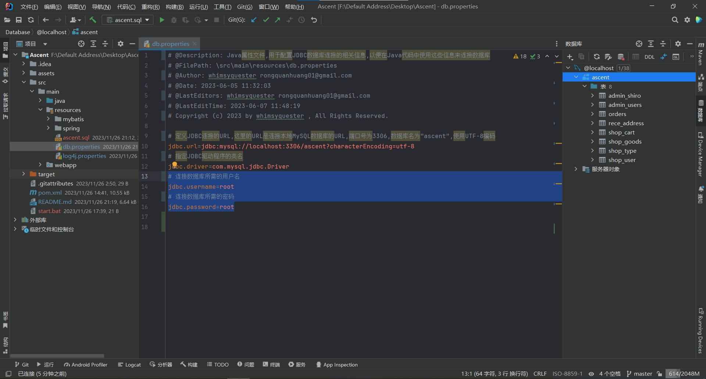
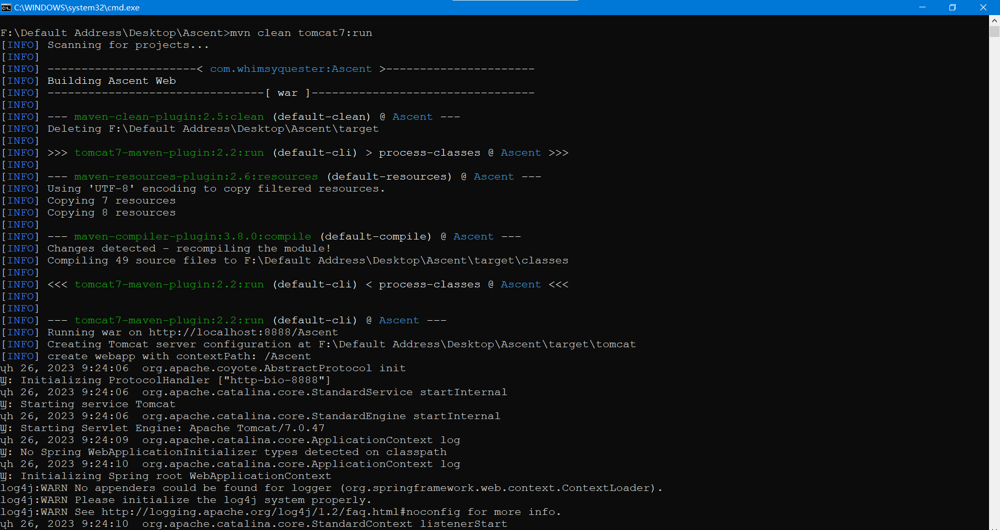
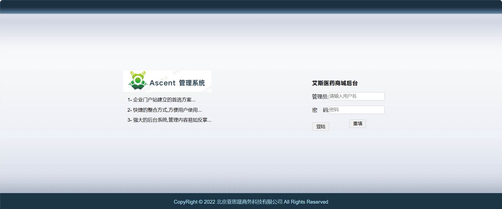

# **<center>Ascent 医药系统</center>**

## 一、简介
&emsp;Ascent 医药系统是一个综合性的医药商城，包含用户端和管理平台。系统旨在高效、便捷地提供医药商务服务，满足用户和管理者的需求。用户端提供丰富的功能，方便用户浏览、查询商品，管理购物车和订单。管理平台则支持商品、订单、会员、地址等管理功能，以及系统设置和权限管理。通过先进的技术和功能模块的整合，Ascent 医药系统为医药行业带来更好的用户体验，提供强大的运营管理功能，助力行业发展。


## 二、功能设计
&emsp;Ascent 医药系统主要包含买家访问的客户端和管理员访问的管理端，具体功能如下

<div style="display: inline-block; width: 30%;">

### 客户端功能

#### 基础功能
- [x] 用户注册
- [x] 用户登录
- [x] 用户退出
- [x] 商品列表
- [x] 商品分类
- [x] 商品详情
- [x] 下单购买
- [x] 搜索商品
- [x] 随机推荐

#### 用户中心
- [x] 联系信息
- [x] 修改密码
- [x] 删除订单
- [x] 收获地址

#### 购物车
- [x] 删除商品
- [x] 商品结算

#### 订单
- [x] 删除订单
</div>
<div style="display: inline-block; width: 30%;">

### 管理端功能

#### 类别管理
- [x] 商品类别
- [x] 添加类别

#### 商品管理
- [x] 全部商品
- [x] 添加商品
- [x] 转移商品类别

#### 订单管理
- [x] 待支付订单
- [x] 已支付订单
- [x] 未发货订单
- [x] 已发货订单

#### 用户管理
- [x] 会员管理
- [x] 会员订单

#### 系统设置
- [x] 管理员
- [x] 权限设置
</div>


## 三、数据库设计




## 四、技术选型
后端框架:&emsp;Spring + Spring MVC + MyBatis <br>
前端框架:&emsp;HTML + CSS + Juery + Layui <br>
数据库:&emsp;MySQL <br>
日志框架:&emsp;Log4j2 <br>
项目管理工具:&emsp;Maven <br>
测试运行环境:&emsp;Tomcat <br>


## 五、项目结构
```
Ascent
├───assets                                   存放项目的静态资源
└───src                                      源代码的根目录
    └───main                                 主要的源代码目录
        ├───java                             Java源代码目录
        │   └───com
        │       └───whimsyquester            顶级包名
        │           ├───controller           控制器类，处理请求和响应
        │           │   └───admin            管理员相关的控制器类
        │           ├───dao                  数据访问对象，用于与数据库进行交互
        │           ├───enums                枚举类型
        │           ├───interceptors         拦截器类，用于拦截请求并进行处理
        │           ├───po                   持久化对象，与数据库表对应的Java对象
        │           ├───service              服务接口和实现类
        │           │   ├───impl             服务接口的实现类
        │           │   │   └───admin        管理员相关的服务接口实现类
        │           │   └───inter            服务接口
        │           │       └───admin        管理员相关的服务接口
        │           └───util                 工具类
        ├───resources                        资源目录，存放配置文件等
        │   ├───mybatis                      MyBatis相关的配置文件，包括映射文件等
        │   └───spring                       Spring框架相关的配置文件
        └───webapp                           Web应用程序目录，存放Web资源
            ├───admin                        管理员相关的页面和资源
            │   └───Images                   图片资源
            │       └───modules              模块相关的CSS文件夹
            │           ├───laydate          LayDate模块的默认CSS文件夹
            │           │   └───default
            │           └───layer            Layer模块的默认CSS文件夹
            │               └───default
            ├───css                          样式表文件
            ├───images                       图片资源
            │   └───Images                   图片资源
            ├───js                           JavaScript文件
            │   ├───Js                       JavaScript文件
            │   └───pages                    页面相关的JavaScript文件
            │       ├───css                  页面样式相关的JavaScript文件
            │       │   └───modules          模块相关的JavaScript文件
            │       │       ├───laydate      LayDate模块的默认JavaScript文件夹
            │       │       │   └───default
            │       │       └───layer        Layer模块的默认JavaScript文件夹
            │       │           └───default
            │       ├───font                 字体文件
            │       ├───images               页面图片资源
            │       │   └───face             表情图片资源
            │       └───lay                  LayUI相关的JavaScript文件
            │           └───modules          模块相关的JavaScript文件夹
            ├───META-INF                     存放与部署相关的元信息
            ├───user                         用户相关的页面和资源
            └───WEB-INF                      存放Web应用程序的配置文件和受保护的资源
```

## 六、运行演示
**1.打开项目，执行 [ascent.sql](src\main\resources\ascent.sql) 文件,创建项目所需数据库**




**2.在 [db.properties](src\main\resources\db.properties) 文件设置数据库连接的账号和密码**




**3.运行批处理脚本文件 [start.bat](start.bat) ,项目开始运行**



**4.客户端和管理端访问**

<<<<<<< HEAD
客户端地址:&emsp;[http://localhost:8888/Ascent/user/](http://localhost:8888/Ascent/user/) 

=======
客户端地址:&emsp;[http://localhost:8888/Ascent/user/](http://localhost:8888/Ascent/user/) <br>
>>>>>>> 03273a6784faf9cd6969b9204edbceb259efd264


<br>管理端地址:&emsp;[http://localhost:8888/Ascent/admin/](http://localhost:8888/Ascent/admin/)



## 7、Star History

[](https://star-history.com/#WhimsyQuester/Ascent&Date)
