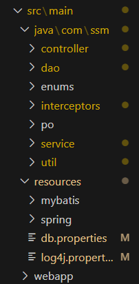

**项目结构**



各组件介绍

```bash
Controller:Controller是MVC框架中的组件之一,它负责处理用户请求并返回响应。Controller常是一个Java类,其中包含处理请求的方法。在Spring MVC框架中,Controller通常使用@Controller注解进行标记。
DAO:DAO是数据访问对象的缩写,它是用于访问数据库的组件。DAO通常是一个Java接口,其中定义了访问数据库的方法。在MyBatis框架中,DAO通常使用Mapper接口进行标记。
Enums:Enums是Java中的枚举类型,它用于定义一组常量。Enums通常用于表示一组相关的常量,例如颜色、状态等。Enums可以在代码中更好地表达意图,并提供更好的类型安全性。
Interceptors:Interceptors是拦截器的缩写,它是用于在处理过程中拦截请求的组件。Interceptors通常用于实现安全性、日志记录、性能监控等功能。在Spring MVC架中,Interceptors通常使用拦截器接口进行标记。
PO:PO是持久化对象的缩写,它是用于表示数据库中的数据的Java对象。PO通常是普通的Java类,其中包含了与数据库表中列对应的属性。在MyBatis框架中,PO通常使用实体类进行标记。
Service:Service是业务逻辑层的组件,它负责处理业务逻辑并调用DAO层进行数据访问。Service通常是一个Java类,其中包含了处理业务逻辑的方法。在Spring框架中,Service通常使用@Service注解进行标记。
Util:Util是工具类的缩写,它是用于提供一组通用的工具方法的组件。Util通常是一个Java类,其中包含了一组静态方法。在Java开发中,常见的Util包括StringUtils、DateUtils等。
```

开发顺序

```bash
首先,定义PO（Persistence Object）,即持久化对象,用于映射数据库中的表结构。PO常是一个普通的Java类,其中的属性对应着表中的字段。
接下来,定义DAO（Data Access Object）,即数据访问对象,用于对数据库进行操作。DAO通常是一个接口,其中定义了对PO进行增删改查等操作的方法。
然后,编写DAO的实现类,实现DAO接口中定义的方法。在实现类中,通常使用JDBC或ORM框架（如MyBatis、Hibernate等）来操作数据库。
定义Enums,即枚举类型,用于定义一些常量或枚举值。Enums通常是一个Java枚举类。
编写Util,即工具类,用于提供一些通用的方法或工具函数。Util通常是一个静态类,其中的方法都是静态方法。
定义Service,即服务层,用于实现业务逻辑。Service通常一个接口,其中定义了一些业务方法。
编写Service的实现类,实现Service接口中定义的方法。在实现类,通常会调用DAO中的方法来操作数据库。
定义Controller,即控制器,用于接收用户请求并调用相应的Service方法来处理请求。Controller通常是一个类,其中的方法对应着不同的请求路径和请求方法。
最后,定义Interceptors,即拦截器,于在请求处理前后进行一些额外的处理。Interceptors通常是一个类,实现了Spring框架中的HandlerInterceptor接口。
```

**打开文件夹作为 Intellij IDEA 项目**


**在本地 MySql 数据库执行项目中的 sql/Shop.sql 文件**


**设置本地 Mysql 数据库的账号和密码**


**maven 插件执行 tomcat7:run-war**


**用户地址**

`http://localhost:8888/Shop-SSM/shop-user/`


**后台管理**

`http://localhost:8888/Shop-SSM/admin/`


# 图书管理系统设计文档

> **本项目已用springboot+datajpa+vue3+typescript+element-plus重构，详情可看 [book_mng_sys_2022](https://github.com/Newway1997/book_mng_sys_2022)**

## 一、简介

图书借阅是学生获取知识的一个很重要的途径，如何既能方便学生借书，又能减轻图书馆管理人员的工作负担，高效地完成图书借阅管理工作，是一件非常重要的事情。web 图书管理系统可以使图书借阅更加方便和快捷。

## 二、演示
请访问[http://112.74.35.49:8002](http://112.74.35.49:8002)
用户测试账号：user,密码:123456
管理员测试账号:admin,密码:123456
数据库建表sql文件：book_store_2019.sql
## 三、技术栈

- 后端：java+Spring+SpringMVC+Mybatis
- 前端：VueJs+Element
## 四、功能设计

图书管理系统主要功能分为两端，一位用户访问的客户端，另一个为管理员访问的管理端。 ### 用户端主要功能有：

1. **用户基础功能**
   - [x] 登录注册注销
   - [x] 修改密码
   - [x] 用户信息查看
   - [x] 用户信息修改
1. **用户图书操作功能**
   - [x] 访问图书列表
   - [x] 查看图书信息
   - [x] 借阅图书
   - [x] 归还图书
   - [x] 查看已借图书


### 管理端主要功能有：

1. **管理员基础功能**
   - [x] 登录注册注销
1. **管理员图书操作功能**
   - [x] 上传图书
   - [x] 查询图书
   - [x] 图书状态管理
   - [x] 修改图书
1. **管理员操作用户功能**
   - [x] 查询用户
   - [x] 封禁解封用户


## 五、 数据库设计

1. 用户

   **user**

   | 字段名   | 类型    | 长度 | 是否为空 | 描述                        |
   | -------- | ------- | ---- | -------- | --------------------------- |
   | id       | int     | 11   | 否       | 主键，用户 id               |
   | username | varchar | 32   | 否       | 用户名                      |
   | password | varchar | 32   | 否       | 密码                        |
   | type     | int     | 11   | 否       | 0 为管理员，1 为用户        |
   | status   | int     | 11   | 否       | 用户状态：0 为禁用 1 为启用 |

   **reader**

   | 字段名 | 类型 | 长度 | 是否为空 | 描述 |
   | -------- | ------- | ---- | -------- | -------------------- |
   | id | int | 11 | 否 | 主键，读者 id |
   | name | varchar | 32 | | 姓名 |
   | age | int | 11 | | 年龄 |
   | sex | int | 11 | | 性别 1：男 or 0：女 |
   | phone | varchar | 11 | | 电话 |
   | regdate | datetime | | | 注册时间 |
   | level|int|11|否|读者等级，默认 0 级
   | status | int | 11 | 否 | 读者状态：0 为禁用 1 为启用 |

   **reader_level**
      
   | 字段名 | 类型 | 长度 | 是否为空 | 描述 |
   | -------- | ------- | ---- | -------- | -------------------- |
   | id | int | 11 | 否 | 主键，读者等级 id |
   | max_br_num | int | 11 | 否 | 最大借阅书本数 |
   | max_br_time | int | 11 | 否 | 最大借阅时间 |

1. 图书

   **book**

   | 字段名 | 类型 | 长度 | 是否为空 | 描述 |
   | -------- | ------- | ---- | -------- | -------------------- |
   | isbn | varchar | 32 | 否 | 主键，书籍 ISBN |
   | category_id | int | 11 | | 书籍类别 |
   | bookname | varchar | 255 | | 书名 |
   | author | varchar | 32 | | 作者 |
   | publisher | varchar | 32 | | 出版社 |
   | publish_date | datetime | | | 出版时间 |
   | unit_price|decimal|10| |单价
   |img_url|varchar|255| |图片地址|
   |summary|text|| |简介|
   |all_num|int|11| |总数量|
   |tags|varchar|255| |标签|
   |last_num|int|11| |剩余数量|
   |status|int|11|否|图书状态，0 为下架，1 为上架|

   **category**

   | 字段名 | 类型 | 长度 | 是否为空 | 描述 |
   | -------- | ------- | ---- | -------- | -------------------- |
   | id | int | | 否 | 主键，书籍类别 id |
   | category_name | varchar | 32 | 否| 书籍类别 |

1. 借阅表

   **borrow_book**

   | 字段名 | 类型 | 长度 | 是否为空 | 描述 |
   | -------- | ------- | ---- | -------- | -------------------- |
   | id | int | 11| 否 | 主键，借阅 id |
   | isbn | varchar | 32 | 否| 书籍类别 |
   | reader_id | int | 11 | 否 | 书名 |
   | borrow_date | datetime | |否 | 作者 |
   | return_date | datetime | | 否 | 出版社 |
   | fine | decimal | 10| | 出版时间 |
   |status|int|11|否|借阅状态 0 为未完成，1 为已完成|

## 六、后端设计

1. 实体层
   - User.java :
     - int id
     - String username
     - String password
     - int type
     - int status
   - Reader.java :
     - int id
     - String name
     - int age
     - int sex
     - String phone
     - Date regdate
     - int level
     - int status
     - int maxBrNum
     - int maxBrDay
   - Book:
     - String isbn
     - int categoryId
     - String categoryName;
     - String bookname
     - String author
     - String publisher
     - Date publishDate
     - float unitPrice
     - String imgUrl
     - String summary
     - int allNum
     - ArrayList<String> tags
     - int lastNum
     - int status
   - BorrowBook
     - int id
     - Book book
     - Reader reader
     - Date borrowDate
     - Date returnDate
     - float fine
     - int status
1. 数据访问层
   - UserDao
   - ReaderDao
   - BookDao
   - BorrowDao
1. 服务层
   - BookService
   - UserService
   - ReaderService
   - BorrowBookService
1. 控制层
   - BookController
   - UserController
   - ReaderController
   - AdminController

## 七、 API

1. 用户操作

   1. 用户登录

      | 请求路径 | /api/user/login   |
      | -------- | ----------------- |
      | 请求方法 | post              |
      | 参数     | username,password |
      | 返回值   | user              |

   1. 用户注册

      | 请求路径 | /api/user/register |
      | -------- | ------------------ |
      | 请求方法 | post               |
      | 参数     | username，password |
      | 返回值   |

   1. 用户注销

      | 请求路径 | /api/user/logout |
      | -------- | ---------------- |
      | 请求方法 | get              |
      | 参数     |
      | 返回值   |

   1. 修改密码

      | 请求路径 | /api/user/updatePass |
      | -------- | -------------------- |
      | 请求方法 | post                 |
      | 参数     | newPass,oldPass      |
      | 返回值   |

   1. 获取用户信息

      | 请求路径 | /api/reader/getReaderInfo |
      | -------- | --------------------- |
      | 请求方法 | get                   |
      | 参数     |       |
      | 返回值   | reader                 |

   1. 用户信息修改

      | 请求路径 | /api/reader/updateUserInfo |
      | -------- | ------------------------ |
      | 请求方法 | post                     |
      | 参数     | reader                     |
      | 返回值   |reader                     |

1. 书籍操作

   1. 访问图书列表

      请求路径 |/api/book/getBooks
      --------|--------
      请求方法 | get
      参数 | pageSize，curPage
      返回值 | books
      
   1. 查看图书信息

      请求路径 | /api/book/getBookDetail
      --------|--------
      请求方法 | get
      参数 | isbn
      返回值 | book

   1. 借阅图书

      请求路径 | /api/book/borrowBook
      --------|--------
      请求方法 | get
      参数 | isbn
      返回值 | book

   1. 归还图书

      请求路径 | /api/book/returnBook
      --------|--------
      请求方法 | get
      参数 | isbn
      返回值 | book

   1. 查看已借图书

      请求路径 | /api/borrowBook/getBorrowBooks
      --------|--------
      请求方法 | get
      参数 |
      返回值 | borrowBooks

   1. 上传图书

      请求路径 | /api/book/uploadBook
      --------|--------
      请求方法 | post
      参数 | book
      返回值 |

   1. 上架图书

      请求路径 | /api/book/enableBook
      --------|--------
      请求方法 | get
      参数 | isbn
      返回值 |

   1. 下架图书

      请求路径 | /api/book/disableBook
      --------|--------
      请求方法 | get
      参数 | isbn
      返回值 |

   1. 修改图书

      请求路径 | /api/book/updateBook
      --------|--------
      请求方法 | get
      参数 | newBook
      返回值 |

   1. 查询用户

      请求路径 | /api/user/getAllUsers
      --------|--------
      请求方法 | get
      参数 | curPage,pageSize
      返回值 | users

   1. 封禁用户

      请求路径 | /api/user/disableUser
      --------|--------
      请求方法 | get
      参数 | id
      返回值 |

   1. 启用用户

      请求路径 | /api/user/enableUser
      --------|--------
      请求方法 | get
      参数 | id
      返回值 |
